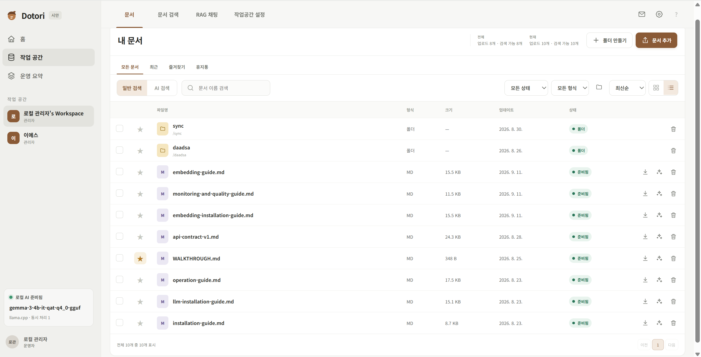

# 도토리 문서

도토리는 문서 관리, 하이브리드 검색, 검색 증강 생성(RAG) 등 모든 과정을 직접 운영할 수 있는 셀프호스팅 문서 작업 공간입니다. 문서, 검색 인덱스, 로컬 AI 런타임을 운영자가 관리하는 Docker Compose 환경 안에 보관합니다.

개인 및 소규모 팀이 외부 클라우드 서비스를 사용하지 않고 최소한의 리소스로 쾌적하게 문서 검색 및 RAG를 경험할 수 있습니다. 웹 UI 뿐만 아닌 CLI 및 MCP 서버로 확장을 도와줍니다. 사용 중인 PC나 원격 저장소에 쉽게 설치하여 어디서든 사용할 수 있습니다.

  

영문 문서는 [README.md](README.md)를 참고하세요.  상세 내용은 [Walkthrough](./documents/WALKTHROUGH.md)을 참고하세요.

## 주요 기능

- 계정과 작업 공간을 생성하여 파일과 문서 기능을 안전하게 분리할 수 있습니다
- 휴지통, 즐겨찾기, 최근 파일 등을 포함한 폴더 및 파일 관리
- 다양한 형식의 텍스트 파일의 분석 기능
- 자연어 검색을 통한 문서 검색 기능
- 외부로 정보가 유출되지 않고 문서 내용을 기반으로 답변을 제공하는 RAG 기능
- 시스템 사양을 바탕으로 직접 고르는 로컬 LLM 설치 및 사용 기능
- 원하는 기능만을 선택하여 설치 및 운영할 수 있습니다
- 한국어와 영어 웹 UI
- 외부 AI 모델 연동을 위한 기능
- 로컬 임베딩/LLM 모델 설치 지원 및 외부 endpoint 연결 모두 지원

> 주의
> 로컬 LLM은 Dotori 설치 도우미를 통해 설치하거나 직접 운영 중인 로컬 LLM을 사용해야 인터넷 연결 없이 안전하게 사용할 수 있습니다.
> 외부 LLM(ChatGPT, Claude 등)을 선택하는 경우, 문서 내용이 외부로 제공될 수 있습니다.

## 설치 모드

시스템에 제공하는 설치 도우미(start.bat)을 통해 코딩 없이 서버를 설치할 수 있습니다.
관련 내용은 [설치 가이드](docs/installation-user-guide.md)를 참고하세요.

설치 모드에서 제공하는 옵션은 다음과 같습니다:
1. 선택적 기능 활성화(자연어 검색 기능, RAG 기능을 끄고 킬 수 있습니다)
2. 로컬 LLM 설치 가이드
3. 서버 운영 환경설정 가이드
4. 서버 외부접속 도메인설정

## 빠른 시작

### 요구 사항

- Docker Engine 또는 Docker Desktop
- Python 3.x
- (선택) vLLM GPU 런타임 사용 시 NVIDIA 드라이버와 NVIDIA Container Toolkit
- (선택) Hugging Face 토큰

Windows에서는 Docker Desktop의 WSL2 백엔드를 권장합니다.

## 프로젝트 상태

도토리는 현재 개발 중입니다. 
현 소스에는 소개된 기능들이 제공되고 있으며, 실험적 기능들이 포함되어 있습니다.
버그 및 기능 건의는 이슈 혹은 이메일을 통해 부탁드립니다.

## 라이선스

[LICENSE](LICENSE)를 참고하세요.
