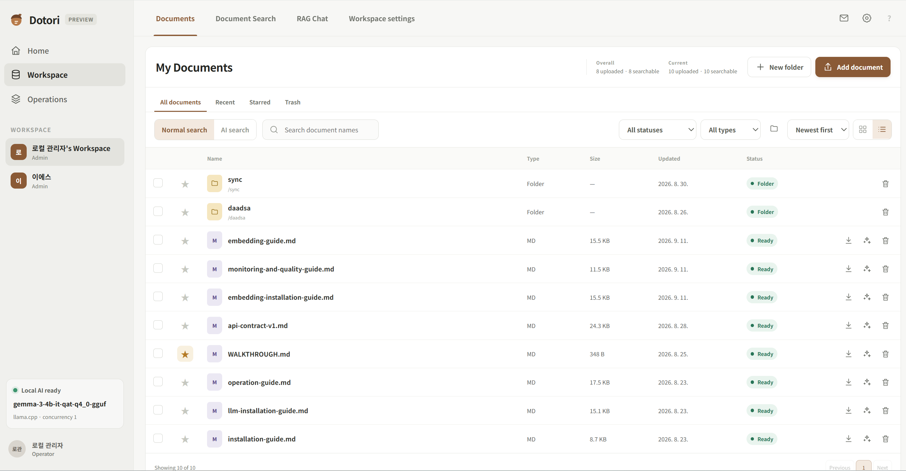

# Dotori Documents

Dotori is a self-hosted document workspace for document management, hybrid search, and retrieval-augmented generation (RAG) on a single server. Documents, search indexes, and local AI runtimes remain in an operator-managed Docker Compose environment.

  

For Korean documentation, see [README.ko.md](README.ko.md). For the full documentation set (installation, operations, monitoring, etc), start at [documents/](documents/WALKTHROUGH.md).

## Key Features

- Multiple accounts with secure separation of files and document features
- Folder and file management with authentication, trash, favorites, and recent files
- Analysis of PDF, HWP, DOCX, and other text-based document formats
- Natural-language document search
- Local RAG that answers questions from document contents without sending data to an external provider
- Guided installation and use of a local LLM selected for the server's hardware
- Three installation modes, from file management only to a complete local RAG stack
- Korean and English web interfaces, with support for external AI models
- Optional external, OpenAI-compatible embedding endpoints (OpenAI, vLLM, Ollama, or a custom server) in place of the local embedding and LLM models

> [!CAUTION]
> The operator must select the local LLM. AI models and runtimes are managed as server-wide settings, not per-user settings.
> When an external LLM such as ChatGPT or Claude is selected, document content may be sent to the external provider.

## Installation Mode

The included installation assistant, `start.bat`, lets operators set up the server without writing code. See the [installation guide](documents/installation-guide.md) for details.

The installer provides the following options:

1. Optional feature activation, including enabling or disabling natural-language search and RAG
2. Local LLM installation guidance
3. Server environment configuration guidance
4. External-access domain configuration

## Quick Start

### Requirements

- Docker Engine or Docker Desktop
- Python 3.x
- An NVIDIA driver and NVIDIA Container Toolkit when using the vLLM GPU runtime
- A Hugging Face token when the selected model requires authentication

Docker Desktop with the WSL2 backend is recommended on Windows.

## Project Status

Dotori is under active development. The current source provides the features described above and includes experimental functionality. Please report bugs and feature requests through an issue or by email.

## License

See [LICENSE](LICENSE).
