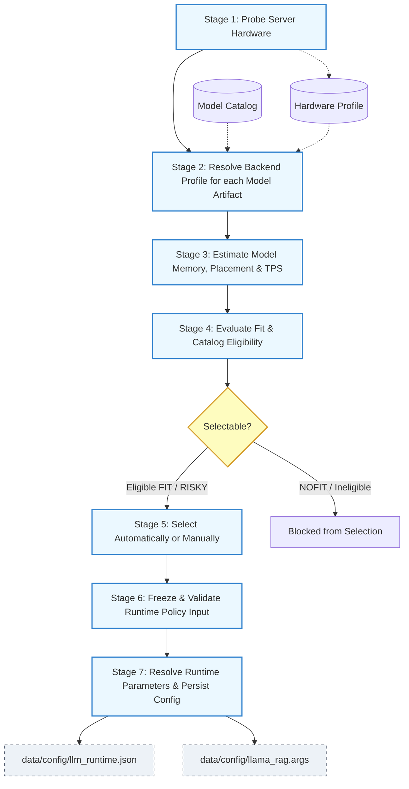

# LLM Installation Agent Contract

> This is the short implementation contract that coding agents may read by default.
> This service is under llm_installation_helper directory of app.

## Core Policy

Dotori is a self-hosted service.

LLM Installation provides local model selection and installation.

The local LLM runtime for RAG answer generation is selected at the server installation level, not per logged-in user.

LLM model/runtime selection is allowed only:

- during the initial installation flow
- when an operator explicitly requests re-detection or reconfiguration

Normal RAG requests must not perform runtime discovery.

## Request-Time Prohibitions

During ordinary RAG request processing, do not run:

- hardware probing
- Docker status scanning
- model download
- endpoint discovery
- runtime auto-start
- model re-selection
- user-specific dynamic model routing

RAG jobs must use the saved runtime snapshot from:

```text
data/config/llm_runtime.json
```

If the runtime config is missing or invalid, fail with an explicit runtime-not-configured error.
Request-time code must not rebuild a serving plan or select a fallback model.

## Installation Pipeline

The installation flow has seven ordered stages:

```text
1. Probe server hardware.
2. Resolve one backend profile for every compatible model artifact; mark artifacts with no compatible backend as unavailable.
3. Estimate model memory, backend-specific RAM/VRAM placement, and performance (TPS).
   - Baseline Serving Assumption: For catalog assessment (Step 3 & 4), the system assumes a baseline concurrency of `concurrency = 1` and a context length of `context_length = 4096` (or `min(model_max_context_length, 4096)`) to evaluate candidate fitness before the operator selects a priority preset.
4. Evaluate each catalog entry and assign FIT, RISKY, or NOFIT without changing its backend or placement.
5. Ask for `speed`, `balanced`, or `quality`, then either automatically select a ranked model or let the operator choose from the assessed catalog. Any RISKY selection requires explicit confirmation.
6. Freeze the selected assessment and hardware profile into an integrity-checked RuntimePolicyInput snapshot.
7. Resolve runtime parameters and persist the final runtime config.
```

### Installation Pipeline Flowchart



Backend selection and memory fit evaluation happen before runtime policy.
Runtime policy must not reselect the model or backend and must not recalculate FIT/RISKY/NOFIT unless explicit user request. 
It preserves the assessment status received from the catalog.

After the pipeline is completed, `llm_runtime.json` will be created.

Data ownership:

```text
InstallationOptions:
  priority_preset + derived cluster mode + internally configured context cap

HardwareProfile:
  CPU + effective RAM + disk + accelerator devices + runtime prerequisites

BackendResolution:
  artifact + backend_status + fixed runtime/backend_profile + reason

CatalogAssessment:
  model + artifact + BackendResolution + ResourceEstimation + FitEvaluation + CatalogEligibility

SelectedModel:
  selected CatalogAssessment + selection_mode + priority_preset + selection evidence

RuntimePolicyInput:
  immutable SelectedModel assessment + hardware snapshot + integrity digest

ResolvedRuntimeConfig:
  RuntimePolicyInput + derived context/parallel/cache/layer/thread/batch parameters
```

---

## Supported Backend Profiles

For more on supported profiles and fit evaluation, see [fit-evaluation.md](../llm_installation_docs/fit-evaluation.md).

Initial supported backend profiles:

1. `vllm-cuda`
2. `llamacpp-cpu`
3. `llamacpp-gpu-offload`

Stage 2 is defined in [backend-profile-selection.md](../llm_installation_docs/backend-profile-selection.md).
It is the only stage allowed to select `runtime` and `backend_profile`.

Stage 3 is defined in [stage3-resource-estimation.md](../llm_installation_docs/stage3-resource-estimation.md).
It owns baseline memory estimation, memory placement, and decode TPS estimation.

Stage 4 is defined in [fit-evaluation.md](../llm_installation_docs/fit-evaluation.md).
It owns `fit_status` and catalog eligibility; it must not alter Stage 2 or Stage 3 results.

Stage 5 is defined in [stage5-model-selection.md](../llm_installation_docs/stage5-model-selection.md).
It is the only stage allowed to rank catalog assessments and select a model.

Stage 6 is defined in [stage6-runtime-handoff.md](../llm_installation_docs/stage6-runtime-handoff.md).
It is the only stage allowed to construct the immutable Stage 7 input.

### Variable & Configuration Name Mapping
To prevent variable name mismatches between UI, database, configuration file, and estimation logic, use the following mapping:

| Concept | Python Object Field | UI Catalog Field / json key | Examples |
|---|---|---|---|
| Serving Engine | `runtime` | `"runtime"` | `"llama.cpp"`, `"vllm"` |
| Backend Profile | `backend_profile` | `"backend"` | `"llamacpp-cpu"`, `"llamacpp-gpu-offload"`, `"vllm-cuda"` |
| Unique Artifact ID | `id` | `"id"` | `"qwen2.5-7b-instruct-q4_k_m"` |
| Base Model ID | `model_id` | `"model_id"` | `"qwen2.5-7b-instruct"` |
| Fit Status | `fit_status` | `"fit_status"` | `"FIT"`, `"RISKY"`, `"NOFIT"` |
| Priority Preset | `priority_preset` | `"priority_preset"` | `"speed"`, `"balanced"`, `"quality"` |
| Selection Mode | `selection_mode` | `"selection_mode"` | `"automatic"`, `"manual"` |

---

## Required Catalog Fields

Each assessed catalog entry (represented as `CatalogAssessment` and serialized in `catalog_rows`) must expose at least:

- `id`: The unique catalog entry/artifact ID (e.g. `"qwen2.5-7b-instruct-q4_k_m"`).
- `model_id`: The base model architecture/config ID.
- `runtime`: The serving engine, or null when `backend_status` is `"UNAVAILABLE"`.
- `backend_status`: Stage 2 result (`"AVAILABLE"` or `"UNAVAILABLE"`).
- `backend_profile`: The fixed execution backend profile, or null when `backend_status` is `"UNAVAILABLE"`.
- `backend_reason_code`: Stable machine-readable selection or incompatibility code.
- `backend_reason`: Human-readable explanation of the selection or incompatibility.
- `required_ram_mb`: The final resolved RAM requirement in megabytes; null for an unavailable backend.
- `required_vram_per_gpu_mb`: VRAM requirements per GPU in megabytes; null for an unavailable backend.
- `disk_required_mb`: Stage 3's resolved disk requirement in MiB; never the catalog's unresolved zero sentinel.
- `memory_estimate`: Pool-neutral memory estimation details, or null for an unavailable backend.
- `memory_placement`: Resolved RAM/VRAM placement, or null for an unavailable backend.
- `estimated_decode_tps`: Estimated decode TPS rounded to 1 decimal place, or null for an unavailable backend.
- `fit_status`: The evaluation result (`"FIT"`, `"RISKY"`, or `"NOFIT"`).
- `fit_reason_codes`: Stable machine-readable reasons for `RISKY` or `NOFIT`.
- `catalog_status`: Policy result (`"ACTIVE"`, `"DISABLED"`, or `"BLOCKED"`).
- `auto_selectable`: True only when automatic selection may choose the entry.
- `manual_selectable`: True only when the operator may choose the entry from the catalog.

Runtime parameters are added only after Stage 5 produces a confirmed
`SelectedModel`.

---

## Fit Rules

For more on fit rules, see [fit-evaluation.md](../llm_installation_docs/fit-evaluation.md).

Do not add RAM and VRAM into a single interchangeable pool.

---

## Installation Priority Options

The installer exposes one high-level priority:

- `speed`
- `balanced`
- `quality`

It also exposes selection mode:

- `automatic`: select the highest-ranked eligible assessment.
- `manual`: show the assessed catalog and choose one eligible entry.

The installer should not ask the operator to free-form enter:

- an arbitrary model id outside the assessed catalog
- context length
- concurrency
- batch size
- ubatch size

Those values are resolved by Stage 7 from the selected assessment and stored in
the serving profile. Stage 1 and Stage 3 provide hardware and baseline estimates
but do not choose preset-specific runtime parameters.


Only eligible `FIT` and `RISKY` entries are selectable. `NOFIT`, disabled,
blocked, hidden, and operator-selection-disabled entries are diagnostic only.

---

## Output Files

Runtime selection should write:

```text
data/config/llm_runtime.json
```

For llama.cpp, generated runtime arguments may also be written to:

```text
data/config/llama_rag.args
```

For vLLM, generated runtime arguments may also be written to:

```text
data/config/vllm_rag.args
```

---

## Agent Rule

For implementation work, read this file first.

Read detailed files only when needed:

- [runtime-policy.md](../llm_installation_docs/runtime-policy.md)
- [fit-evaluation.md](../llm_installation_docs/fit-evaluation.md)
- [memory-estimation.md](../llm_installation_docs/memory-estimation.md)
- [per_token_estimation.md](../llm_installation_docs/per_token_estimation.md)
- [hardware_profiler.md](../llm_installation_docs/hardware_profiler.md)
- [validation_commands.md](../llm_installation_docs/validation_commands.md)

Do not read:

```text
docs/reference/llm_installation_policy_and_memory_estimation.md
```

unless the user explicitly asks for full historical context or detailed policy rationale.
